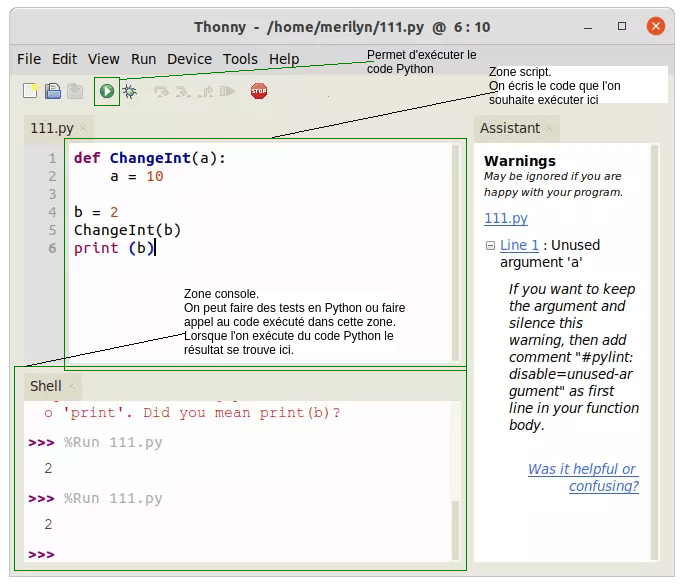

# Initiation Python  

## Environnement  
Pour programmer en Python, il faut ouvrir un éditeur de texte dédié. 
En général nous utilisons __Thonny__.

Ouvrez __Thonny__ sur votre ordinateur.  
Quelques chose comme ceci devrait apparaitre.  

## TP  
!