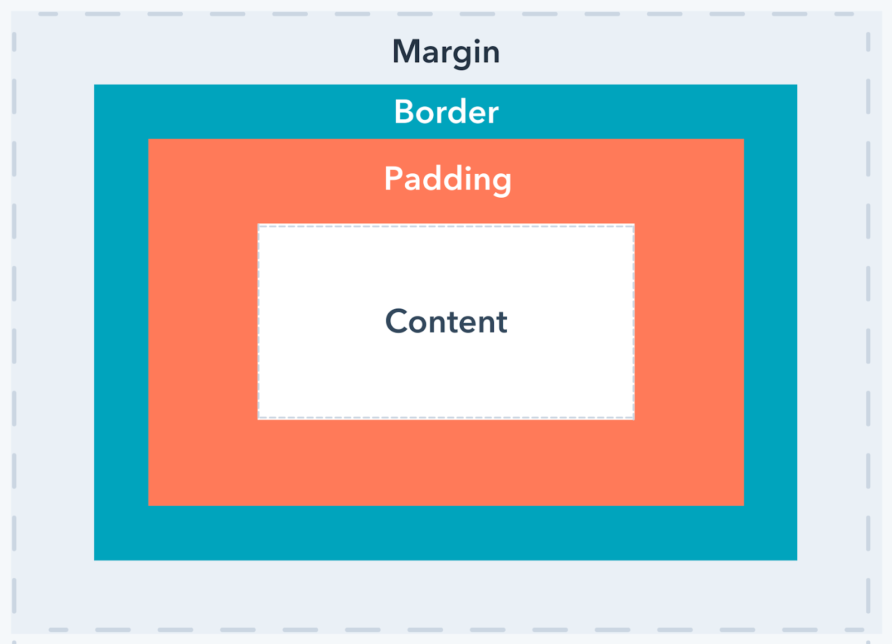

# Activité HTML et CSS  

## Introduction  

Afin de créer une page Web on peut utiliser plusieurs langages. Les premiers et les plus utilisés sont les langages __HTML et CSS__.  


## Création de page Web  

Pour créer une page web il suffit simplement de créer un fichier avec l'extension `.html`, par exemple `mon_site.html`.  
Une fois le fichier crée, on peut __écrire dans un éditeur de texte(code)__ notre code HTML et __observez le rendu sur un navigateur__.   


## HTML  

Le langage __HTML__ (HyperText Markup Language) permet de se concentrer sur le __contenu__ de notre page web.  
C'est dans le code HTML qu'on précise si l'on veut mettre sur notre page du texte, une vidéo, un son, un lien, etc.  
On peut également créer des zones de texte particulières en désignant une section, un paragraphe, etc.  

Le langage HTML est un langage de __balisages__. On entoure de __balises__ les éléments de notre site.  
Chaque __balise ouvrante__ est associée à une __balise fermante__ (sauf quelques exceptions).  
On définit une balise avec les caractères `<` et `>`.  
Par exemple, la balise `<p>` permet de définir un paragraphe.  


```HTML
<p>Mon chat est très grincheux</p>
```

__Chaque balise à une fonction bien précise.__  

## Glossaire des balises HTML

### Balise sur le texte  

Certaines balises permettent de mettre en `gras` ou en `italique` du texte. D'autres permettent de `surligner` ou de `souligner` du texte.

```HTML
Voici du texte en <b>gras</b> et voici du texte en <i>italique</i>

Il est <mark>important</mark> de <u>souligner</u> ses réponses lorsque l'on répond à une question. 
```


### Les titres

Les __`titres`__. Il est possible de définir plusieurs niveaux de titre à l'aide des balises `<h1>`,`<h2>`,`<h3>`, `<h4>`, ... `<h6>`.  
```HTML
<h1>Mon titre principal</h1>
<h2>Mon sous-titre</h2>
...
```

### Les listes

Les __`listes`__. Il existe 2 types de listes en HTML : les listes ordonnées et les listes non ordonnées.

On utilise la balise `<ol>` pour définir une liste ordonnée (Ordered List) et la balise `<ul>` pour définir une liste non ordonnée (Unordered List). À l'intérieur de nos balises `<ul>` ou `<ol>`, on utilise la balise `<li>` pour écrire un élément de notre liste.

```HTML

<h1> Recette de cuisine </h1>

<h2> Crèpes </h2>


<h3> Ingrédients </h3>

<ul>
    <li>Oeufs</li>
    <li>Beurre</li>
    <li>Huile</li>
    <li>Sucre en poudre</li>
    <li>Farine</li>
    <li>Lait</li>
</ul>


<h3> Préparation </h3>

<ol>
    <li>Faire fondre le beurre</li>
    <li>Mettre la farine dans le saladier</li>
    <li>Déposer les oeufs</li>
    <li>Déposer le sucre</li>
    <li>Déposer le beurre</li>
    <li>Mélanger délicatement en ajoutant le lait</li>
</ol>
```

### Les liens hypertextes  

Les `liens hypertextes`. Il est possible de mettre un lien vers une page web à l'aide de la balise <a> et de l'attribut `href="https://le_lien_d_une_page.fr"`.

```HTML
En 1960, Margaret Hamilton constituait une exception dans le milieu scientifique. Pour plus d'informations vous pouvez cliquer<a href="https://fr.wikipedia.org/wiki/Margaret_Hamilton_(scientifique)">ici</a>
```

### Les images  

Les `images`. On peut intégrer une image avec la balise `` et l'attribut `src="nom_de_mon_image.png"`. 
Pour cela 2 solutions.   
1. On peut se rendre sur internet et faire un clique droit sur une image, ensuite on sélectionne `Copier le lien de l'image` et on le colle dans `src="lien_vers_l_image"`.  

2. Il faut veiller à ce que l'image que l'on souhaite intégrer se trouve au même endroit que notre fichier HTML ; sinon, il faut ajouter le chemin vers le dossier qui contient l'image dans l'attribut src. Par exemple : `src="Documents/photo_de_vacances/Le_Port.png"`.  

```HTML

```
  

### Les vidéos  

Les __`vidéos`__. Il est possible d'intégrer une vidéo youtube à notre page web. Pour cela il suffit d'aller sur youtube, cliquer sur la vidéo de notre choix, puis faire un clique droit sur la vidéo et sélectionner `Copier le code d'intégration` et le coller dans notre code HTML.

### Les tableaux  

Les __`tableaux`__. On peut créer des tableaux en HTML à l'aide de la balise `<table>`. Il faut ensuite définir des lignes dans notre tableau à l'aide de la balise `<tr>`. Enfin, il faut définir des cellules dans chaque ligne de notre tableau à l'aide de la balise `<td>` (ou `<th>` pour définir un en-tête).

```HTML
<table>
    <tr>
        <th>Record au 100m</th>
        <th>Record au javelot</th>
    </tr>
    <tr>
        <td>17,3</td>
        <td>10,19</td>
    </tr>
    <tr>
        <td>15,2</td>
        <td>12,23</td>
    </tr>
</table>
```

> [!NOTE]
> Toute la documentation concernant le langage HTML est disponible [ici](https://developer.mozilla.org/fr/docs/Web/HTML) 


## CSS  

Le langage __CSS__ (Cascading Style Sheet) permet de se concentrer sur la forme de notre page web.

Ces 2 langages vont très souvent de pair puisqu'une fois que le contenu de notre page est écrit, on souhaite modifier son apparence.    
C'est dans le code CSS que l'on précise, par exemple, la couleur de notre texte, la taille que doit prendre une image ou encore si l'on veut positionner une vidéo en haut à droite de notre page.


### Liens avec le fichier HTML  

Nous avons créé notre page web avec un fichier `html`. Pour définir le style de notre page, il faut créer un fichier `css`.
Une fois le fichier `css` créé, il faut le lier au fichier `html` de notre page afin que notre page suive les règles de style écrites dans notre fichier `css`.    


> [!TIP]   
> Pour cela, il faut que les fichiers html et css se situent au même endroit.    
> Ensuite, on ajoute le nom de notre fichier css dans l'attribut href de la balise `<link>`. La balise `<link>` se situe dans la balise `<head>` de notre fichier.  
> Une fois le lien établi entre les 2 fichiers, on peut écrire des __règles de style__ dans notre fichier __CSS__ qui vont agir sur les éléments de notre fichier __HTML__.  


### Définition d'une règle de style  

En CSS, pour agir sur le style de notre page web, il faut définir des __règles__.

On définit une __règle__ en notant le nom de la balise sur laquelle on souhaite agir. Puis, on ouvre des accolades `{ }`, dans lesquelles on vient écrire les __propriétés__ de notre élément ainsi que la __valeur__ que l'on souhaite lui attribuer.

Ici, le code __CSS__ suivant agit sur tous les éléments contenus dans la balise `<body>`. La propriété `color` agit sur la couleur du texte ; ici, le texte sera rouge. La propriété `background-color` agit sur la couleur de fond. Enfin, `font-size` permet de modifier la taille du texte.

```CSS
body { 
    color : red; 
    background-color : blue;
    font-size : 10px;
}
```  

Il est possible de définir des règles CSS pour __toutes__ les balises de notre fichier HTML. (`body`,`h1`,`h2`,`u`,`i`, etc ... ).  

## Glossaire des propriétés CSS  

### Couleur d'un texte

On peut définir la couleur d'un texte avec la propriété `color`. Les valeurs peuvent être le nom d'une couleur en anglais ou encore un code rgb. (on peut trouver le code rgb d'une couleur sur ce [ce site](https://htmlcolorcodes.com/fr/))

```css
    p {
      color: blue;
    }
```

### Couleur de fond  
On peut définir la couleur de fond d'un élément avec la propriété `background-color`. Les valeurs sont les mêmes que pour `color`.

```css
    body {
      background-color: lightgray;
    }
```

### Taille de la police  

La taille de la police du texte peut être modifiée avec la propriété `font-size`. Les valeurs sont un nombre suivie de `px`. 

```css
    h1 {
      font-size: 24px;
    }
```

### Définir une image de fond 

Pour changer l'arrière-plan d'un élément en utilisant une image en CSS, on peut utiliser la propriété `background-image`.

```css
body {
  background-image: url('chemin/vers/l-image.jpg');
}
```

Voici un schéma qui montre comment chaque élément en css est constitué.   


### Encadré  

Il est possible d'encadrer un élément en lui ajoutant une bordure, pour cela on utilise la propriété `border` en ajoutant la valeur :
   - `solid` : Pour une bordure pleine.
  - `dashed` : Pour une bordure en pointillés.
  - `dotted` : Pour une bordure en points.
  - `double` : Pour une bordure double.
 
On peut ensuite ajouter un espace suivi du nom de la couleur de notre bordure.

```css
p {
  border: solid red;
}
```


### Espace en dehors d'un élément

On peut définir l'espace extérieur autour d'un élément à l'aide de la propriété `margin`.  

```css
    p {
      margin: 20px; /* ajoute un espace de 20 pixels autour des éléments p */
    }

    h1 {
      margin: 20px 40x; /* ajoute un espace de 20 pixels verticalement et 40px horizontalement autour des éléments p */
    }
```


### Espace à l'intérieur d'un élément

On peut définir l'espace à l'intérieur d'un élément à l'aide de la propriété `padding`.  
    
```css
    p {
      padding: 15px; /* Ajoute un espace de 15 pixels à l'intérieur des éléments p*/
    }
```


### Alignement du texte

On péut définir l'alignement du texte à l'intérieur d'un élément avec `text-align`.
`text-align` peut prendre différentes valeurs(`left`, `right`, `center`, ...) :


```css
    h2 {
      text-align: center; /* Cela centrera le texte des titres <h2>. */
    }
```
   
### Largeur et hauteur d'un élément 

La propriété `width` définit la largeur et la propriété `height` définit la hauteur d'un élément.
    

```css
    p {
        width: 300px; /* fixe la largeur des éléments p à 300 pixels. */
        height: 200px; /* fixe la hauteur des éléments p à 200 pixels. */
    }
```
    


> [!NOTE]
> Toute la documentation concernant le langage CSS est disponible [ici](https://developer.mozilla.org/fr/docs/Web/CSS) 


