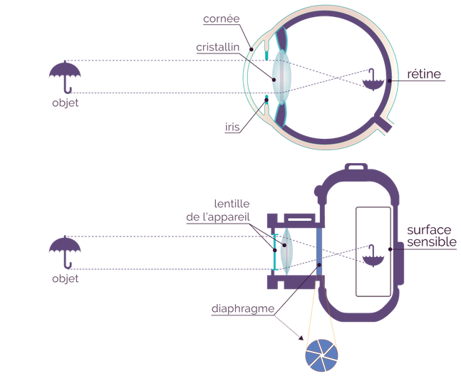
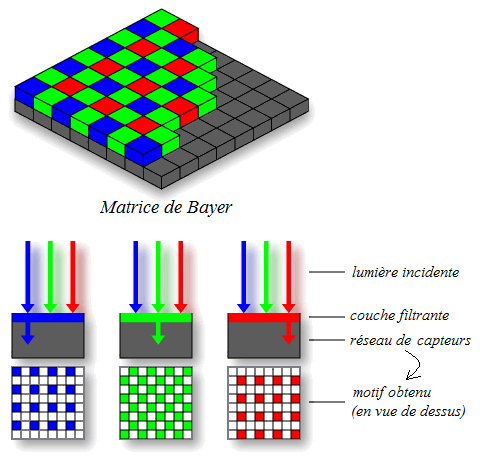
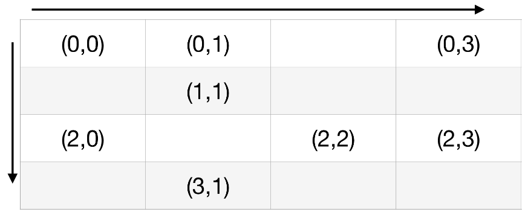
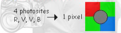

# La photographie numérique  

## Histoire    

- En 1826, le Français Nicéphore Niépce (lycée de Chalon-sur-Saône, rue à Nice, ...) invente le principe de la photographie argentique.  
    
- En 1957, Russell Kirsch fait partie des premiers à numériser une photo, notamment celle de son fils.  
  
- L'apparition des appareils photo numériques se produit en 1975. Ce sont les premiers appareils capables d'enregistrer une image sous forme de __bits__, qui peuvent être stockés en mémoire.
- Les premiers téléphones capables de prendre des photos apparaissent dans les années 2000, ce qui démocratise la photo numérique.  
- 2007 : arrivée du smartphone, capable de prendre des photos avec une qualité plus que satisfaisante.

## Comment enregistrer un moment de vie ?  

Tous les appareils photographiques fonctionnent avec le même principe découvert au 5ᵉ siècle avant Jésus-Christ : la __chambre noire(camera obscura)__.

  

Un trou se trouve sur un des côtés de la boîte et une plaque d'étain recouverte de goudron de l'autre côté. Les rayons lumineux entrent dans la boîte par le trou et forment une image sur la plaque. Les joies de la physique font alors apparaître une image qui a la particularité d'être inversée.

Ce principe est similaire à celui du fonctionnement de nos yeux ou d'un appareil photographique.

Au XXᵉ siècle, on utilise l'appareil photo argentique. Une pellicule argentique est composée de sels d'argent qui réagissent chimiquement lorsqu'ils sont exposés à la lumière, ce qui, après un certain temps, révèle l'image.

Aujourd'hui, nos appareils ne sont pas argentiques mais numériques. Ils ne possèdent donc pas de pellicule qui réagissent à la lumière...

__Question : Comment un appareil numérique peut-il afficher une image sur un écran ?__

## Capteur numérique  

Les capteurs numériques se trouvent dans tous les objets permettant de prendre des photos numériques (téléphone, tablette, webcam, satellite, ...). Leur taille varie en fonction de l'objet. Par exemple, les capteurs numériques des smartphones sont plus petits que ceux des appareils photographiques haut de gamme.

Un capteur numérique est constitué d'une grille de __photosites__.
Du grec phōs (lumière) et sitos (grain, cellule). Les photosites sont des cellules permettant de capter la lumière.

Les capteurs numériques sont composés de photosites.
Chaque photosite est recouvert d'un filtre coloré en rouge, vert ou bleu, et ne laisse passer que les rayons de sa couleur. C'est grâce à cela que nous pouvons voir nos images en couleur.

  

Les photosites sont disposés selon la disposition de _Bayer_. La particularité de ce placement réside dans le nombre de filtres verts, qui sont deux fois plus présents que les filtres des autres couleurs. Le choix de cette disposition n'a pas été fait aléatoirement, car l'œil humain est plus réceptif à la couleur verte.   

__Question : Si les photosites des capteurs ne laissent passer que la couleur rouge, verte ou bleue, comment est-il possible de voir des images de couleur jaune, marron, orange, ... ?__

La __définition__ d'un capteur est le nombre de __photosites__ qu'il possède. 

## L'image numérique   

__Image numérique__ : Une image numérique peut être représentée par un tableau à deux dimensions (matrice) constitué de cases. Chaque case est appelée __pixel__ (Picture element).

Chaque __pixel__ possède une position que l'on nomme coordonnées.
Les coordonnées d'un pixel sont représentées par un couple (i, j) où i (resp. j) possède une valeur comprise entre 0 et la hauteur (resp. largeur).

En __informatique__, pour repérer les coordonnées d'un pixel, on place l'origine du repère en haut à gauche de l'écran.
Voici les coordonnées des pixels d'une image sur un écran.

  

On appelle __définition__ d'une image le nombre de pixels qu'elle contient.
Par exemple, une image contenant 1920 pixels en largeur et 1080 pixels en hauteur possède une définition de 2 073 600 pixels ou 2,07 Mégapixels (1920 $\times$ 1080 = 2 073 600).   

On appelle __résolution__ d'une image le nombre de pixels qu'elle contient sur __une longueur donnée__. Elle est notée en Pixels Par Pouce (ou Pixels Per Inch). Par exemple, un écran avec une définition de 1920 $\times$ 1080 affiche une image en plein écran avec une résolution de 92 ppi.

Chaque pixel contient une information primordiale : __sa couleur__. En général, on représente la couleur d'un pixel par 3 valeurs : celle du rouge, du vert et du bleu, et chaque valeur est comprise entre 0 et 255.  

__Question : Combien de couleurs différentes un pixel peut-il prendre ?__

## Des photosites au pixel  

Un __photosite__ envoie une impulsion électrique lorsqu'il réagit à la lumière. L'intensité électrique émise est proportionnelle à la quantité de lumière reçue.  
Cette impulsion est codée sur 8 bits (1 octet).  

Attention ! Un photosite n'est pas un pixel. Un photosite capture la couleur associée à son filtre, soit rouge, vert ou bleu.
Un pixel, en revanche, possède __une couleur résultante de 3 valeurs(associée au rouge, vert et bleu) numériques comprises entre 0 et 255__.  

Le lien entre les photosites et un pixel est le suivant :  
La couleur d'un pixel est déterminée à partir de 4 photosites (1 rouge, 2 verts et 1 bleu) comme illustré ci-dessous.  

  

