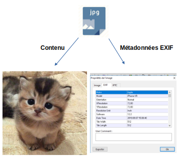

# Métadonnées EXIF  

## Introduction aux Métadonnées 

### Définition des métadonnées
Chaque fichier possède 2 types d'informations, __un contenu__ et des __métadonnées__.

Les __métadonnées__ correspondent à des informations concernant les fichiers.
Elles fournissent des informations contextuelles sur un fichier, ce qui permet de mieux comprendre son contenu, son origine et son utilisation.

    
### Exemples   

Pour un document texte les métadonnées peuvent inclure :  
- le titre  
- l'auteur  
- la date de création  
- etc...  
  
Pour une image elles peuvent inclure des informations sur :  
- la prise de vue  
- le format de fichier  
- etc...  

### Types de métadonnées
Les métadonnées sont classés selon plusieurs types.  

- Métadonnées descriptives : Elles décrivent le contenu d'un fichier (titre, résumé, mots-clés).  
- Métadonnées administratives : Elles fournissent des informations sur la gestion du fichier (droits d'auteur, conditions d'utilisation).  
- Métadonnées techniques : Elles incluent des détails sur le format de fichier, la taille, la résolution, et d'autres caractéristiques techniques.  

### Qu'est-ce que EXIF ?

__Définition :__ EXIF (Exchangeable Image File Format) est un format standard qui permet de stocker des métadonnées dans des fichiers image, principalement des photographies numériques.  

__Historique :__ Développé par l'Association of Imaging Technology and Communications (AITC) en 1995, EXIF est largement utilisé par les appareils photo numériques et les smartphones pour enregistrer des informations sur les images.    

### Informations contenues dans les métadonnées EXIF

- Date et heure de la prise de vue : Indique quand la photo a été prise, ce qui est utile pour l'organisation des images.  
- Modèle de l'appareil photo : Permet d'identifier l'appareil utilisé, ce qui peut être pertinent pour les photographes.  
- Paramètres de prise de vue :  
    - Ouverture (f-stop) : Indique la taille de l'ouverture de l'objectif, influençant la profondeur de champ.  
    -       Vitesse d'obturation : Indique combien de temps le capteur est exposé à la lumière, affectant la luminosité et le flou de mouvement.  
    -     ISO : Indique la sensibilité du capteur à la lumière, influençant la qualité de l'image dans des conditions de faible luminosité.  
    - Coordonnées GPS : Si activées, elles indiquent l'emplacement où la photo a été prise, ce qui peut être utile pour le géotagging.  

