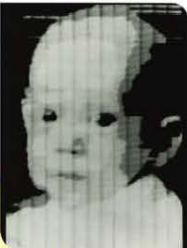

# La photographie numérique  

## Histoire    

- En 1826 le français Nicéphore Niépce(lycée de Chalon-sur-Saône, rue à Nice, ...) invente le principe de photographie argentique.
  
- En 1957 Russel Kirsh fait parti des premier à numériser une photo, notamment celle de son fils. 

- L'apparition des appareils photo numériques voit le jour en 1975. Ce sont les premiers appareils capable d'enregistrer une image sous forme de __bits__ en mémoire.  

## Introduction  
