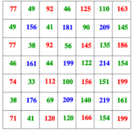
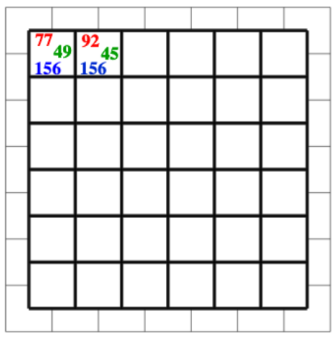

On possède un capteur composé de 49 photosites, accompagné de sa grille de Bayer.    
Notre objectif est de transformer ces 49 photosites en 36 pixels.   
On rappel que pour obtenir la couleur d'un pixel il faut 4 photosites donnant la valeur des 3 composantes RVB.  

  

Compléter le remplissage de la grille avec le code RVB. Pour la composante verte il faut effectuer la moyenne et prendre la valeur arrondie supérieure.  

  