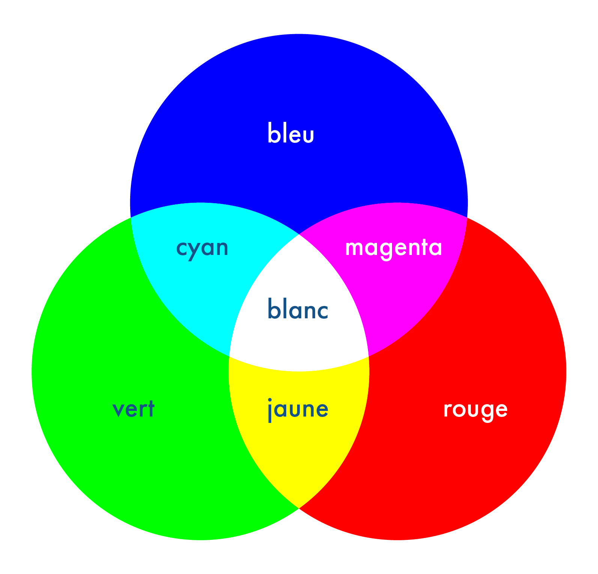
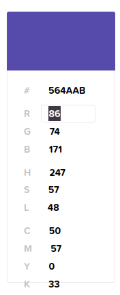

# Images numériques  

## La définition d'une image

Dans cette séance, nous allons explorer les images numériques.  
Nous définirons ce qu'est un pixel et comment les pixels d'une image en couleur sont représentés.  
Nous aborderons également les concepts de __définition__ et de __profondeur de couleur__ d'une image numérique, ainsi que ceux de __résolution__ et de __taille__ d'image.  

> [!TIP]
> On appelle définition d'une image le nombre de pixels qu'elle contient. Par exemple, une image contenant 1920 pixels en largeur et 1080 pixels en hauteur possède une définition de 2 073 600 pixels ou 2,07 Mégapixels (1920 × 1080 = 2 073 600).

Cliquez sur le lien et répondez aux questions suivantes : https://unsplash.com/fr/photos/une-vue-aerienne-de-la-plage-et-des-rochers-dans-locean-Jfv_zYfLC04

> __Q1__ :  Cliquez sur sur la flèche à coté de `télécharger gratuitement`. Il est possible de télécharger l'image en 4 définitions différentes. Lesquelles ? (en nombre de pixels)

> __Q2__ : Certaines informations sont disponibles en desous de l'image. Donnez le nom de la _'license'_ à laquelle est soumise cette image.   

> __Q3__ : Citez une autorisation et une interdiction avec cette _'license'_  

## Les pixels  

Une image numérique peut être représentée par un tableau à deux dimensions (matrice) constitué de cases. Chaque case est appelée pixel (Picture element).  

La couleur d'un pixel est définie par __trois composantes__ : le rouge (R), le vert (V) et le bleu (B).  

En ajustant l'intensité de chacune de ces trois couleurs, il est possible de créer toutes les teintes, selon le principe physique de la synthèse additive des couleurs.  

  

Pour stocker une image, il suffit de conserver les informations de chacun de ses pixels. Étant donné qu'un pixel est défini par ses trois composantes R, V et B, il suffit d'enregistrer ces trois valeurs pour chaque pixel.

> [!TIP] 
> La profondeur de couleur d'une image correspond au nombre de bits utilisés pour coder la couleur de chaque pixel.  
> Les images en couleur standards ont généralement une profondeur de 24 bits (soit 3 $\times$ 8 bits).    
> Chaque octet(groupe de 8 bits) correspond à une composante (Rouge, verte ou bleu) avec des valeurs entières comprises entre 0 et 255.  
> Par conséquent, la couleur d'un pixel est exprimée sous la forme d'un triplet (R, V, B), comme par exemple (51, 255, 141) , où R = 51, V = 255 et B = 141.

> __Q4__ : Le site https://htmlcolorcodes.com/fr/ permet de visualiser toutes les couleurs que l'on peut coder avec une profondeur de 24 bits.
> Une partie est éditable pour entrer un code `RVB` (`RGB` en anglais) et voir à quelle couleur ce code correspond.   

> Reprenez l'exemple du code `RVB` de l'explication précédente, rentrez la valeur des composantes dans la partie éditable du site et dites si cette couleur est plus proche de la couleur d'une fraise, d'un bonbon à la menthe ou d'un poussin. 

> __Q5__ : Quel code `RVB` permet d'obtenir les couleurs suivantes. 
> - Bleu
> - Blanc
> - Jaune
> - Noir
> - Cyan 

> __Q6__ : Que se passe-t-il lorsque chaque composante possède la même valeur ? Essayez avec les valeurs 123 et 200.

> __Q7__ : L'image originale de la __Q1__ possède 4000 pixels de largeur et 2250 pixels de hauteur. Sachant que la profondeur de couleur de cette image est de 24 bits. Calculez la taille du fichier correspondant à cette image en octet.  

> __Q8__ : En utilisant une profondeur de couleur de 24 bits. Combien de couleurs distinctes peut-on obtenir avec le système RVB ? __Expliquez votre réponse__.

## Résolution d'une image  

> [!TIP] 
> La taille d'une image, ou ses dimensions, fait référence à sa largeur et sa hauteur exprimées en pouces, une unité de mesure anglo-saxonne. Un pouce équivaut à 2,54 cm, et son symbole est « " ».  
> La résolution d'une image correspond au nombre de pixels par pouce, souvent exprimée en pixels par pouce(ppp) ou pixels per inch(ppi) en anglais pour l'affichage à l'écran.  
> En pratique, la résolution représente donc le nombre de pixels contenus sur un pouce de longueur.  
> La résolution peut être déterminée à partir de la définition et des dimensions grâce à l'une des deux formules suivantes.  
> $resolution = \frac{\texttt{nb pixels largeur}}{\texttt{largeur en pouce}}$ = $\frac{\texttt{nb pixels hauteur}}{\texttt{hauteur en pouce}}$  

> [!NOTE]
> Exemple de calcul : 
> 
> Hauteur de l'écran : 15,33 cm 
> Largeur de l'écran : 6,77 cm
> Définition de l'écran : 2 770 x 1 224 pixels
> 
> __Donnez en pixels par pouce la résolution de l'écran ?__ 
> La largeur de l'écran est de 6,77 cm. 
> On convertit cette mesure en pouce cela nous donne $\frac{6,77}{2,54} = 2,66"$. 
> L'écran possède 1 224 pixels en largeur sur une longueur de 2,66". 
> On calcule donc la résolution de la manière suivante $\frac{1224}{2,66} = 460,15 ppp$
> 
> On trouve un résultat presque équivalent si on effectue les mêmes calculs avec la hauteur plutôt que la largeur. 
> $\frac{15,33}{2,54} = 6,04"$
> $\frac{2770}{6,04} = 458,95 ppp$
> 
> On peut dire que __$460,15 = 458,95$__  

> __Q9__ : La figure 1 ci dessous représente une image où chaque carré représente un pixel. Donnez la taille (en pouces), la définition (en pixels) et la résolution (en ppp).  

  

