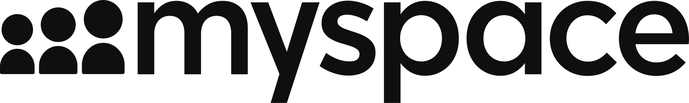
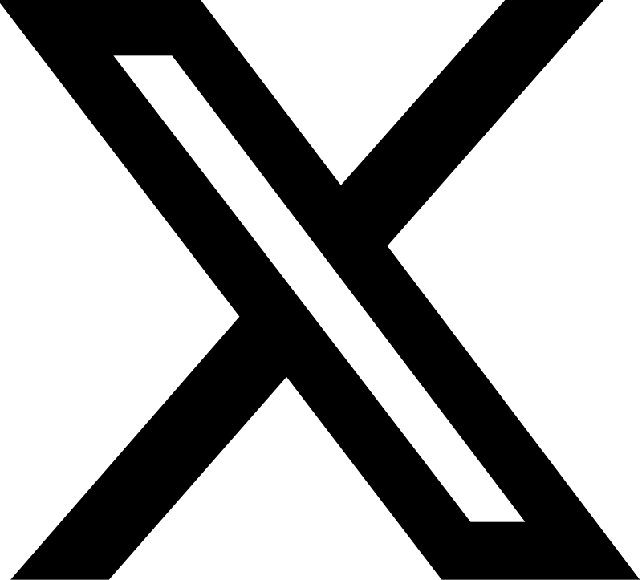
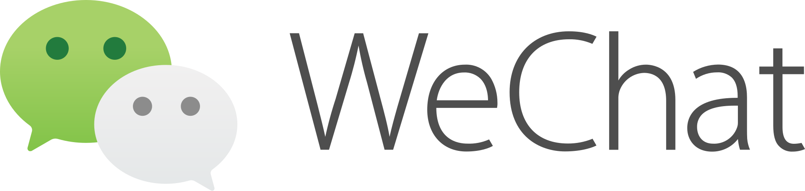
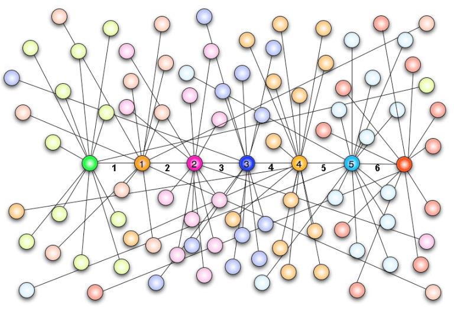
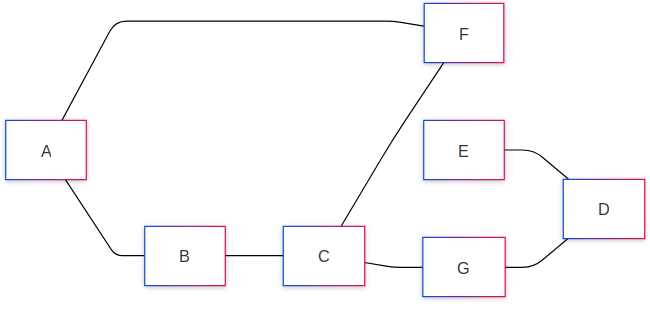
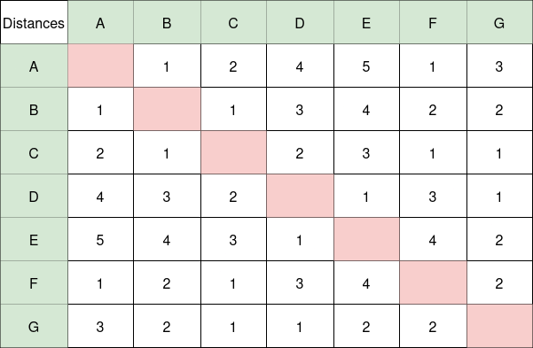
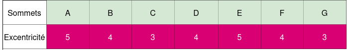
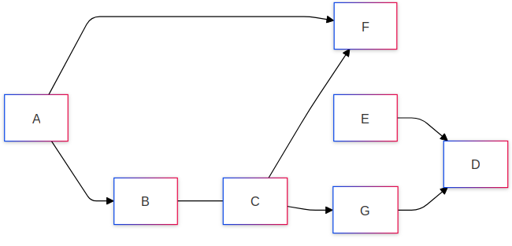
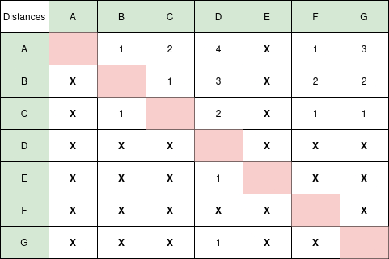
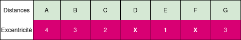

# Réseaux sociaux  

## Introduction 
Les réseaux sociaux ont transformé notre façon de communiquer et d'interagir. En permettant le partage instantané d'informations et la création de liens, ces plateformes ont pris une place prépondérante dans nos vies personnelles.   
Cependant, leur utilisation soulève des préoccupations concernant la vie privée et la désinformation, rendant leur impact sur la société un sujet de débat crucial.   
Nous allons voir à travers ce cours comment sont représentés les réseaux sociaux, comment ils sont rémunérés et quels risques peuvent en découler.   

### Histoire 

- __1995__ : _Classmates_ est l’un des premiers réseaux sociaux qui permettent aux étudiants de rester en relation. 
- __2003__ : apparition de Myspace, aujourd’hui en perte de vitesse, et de _LinkedIn_ (racheté depuis par Microsoft), à vocation professionnelle.  
- __2004__ : apparition de _Facebook_, d’abord réservé aux étudiants de l’université Harvard, puis ouvert au grand public en 2006.  
- __2006__ : apparition de _Twitter_, qui permet l’échange de courts messages, limités au départ à 140 puis à 280 caractères (on parle de microblogage). Aujourd'hui Twitter à changé de nom pour X.  
- __2009__ : lancement de la messagerie instantanée _WhatsApp_ (rachetée depuis par Facebook) qui se substitue à l’utilisation des SMS et MMS chez beaucoup d’utilisateurs.  
- __2010__ : arrivée d’_Instagram_ (racheté depuis par Facebook), qui permet le partage de photos et de vidéos.  
- __2011__ : début de _Snapchat_ qui permet, sur plateformes mobiles, le partage de photos et de vidéos, avec une limitation de durée. 
- __2012__ : l’application chinoise de messagerie _Weixin_ voit le jour. Elle compte plus d'un milliard de comptes utilisateurs en 2018. 
- __2018__ : on estime à 3,2 milliards le nombre d’utilisateurs actifs des réseaux sociaux.  

### Définition et vocabulaire  
__Réseau social__ : Les réseaux sociaux sont des __applications du web__ qui permettent la __mise en relation d’utilisateurs__. Plus particulièrement, cela permet de créer ou de développer des communautés ayant des __intérêts communs__.    

__Identité numérique__ : L'identité numérique (« IDN ») est définie comme __un lien technologique__ entre une __entité réelle__ (personne, organisme ou entreprise) et des __entités virtuelles__ (sa ou ses représentations numériques).

__e-réputation__ : L'e-réputation correspond à __l’opinion générale__ (informations, rumeurs, etc.) sur le Web d'une entité ou d'une personne. Elle reflète la réputation que les internautes lui attribuent.

__identification__ : L'identification est le processus par lequel un utilisateur se __présente__ sur un réseau social. Par exemple _"Bidule43"_.    
 
__authentification__  : L'authentification est le processus qui __vérifie l'identité de l'utilisateur__ après son identification. Généralement en demandant un mot de passe.  

## L'expérience de Milgram - le petit monde

Au début du XXe siècle, un psychologue américain du nom de __Stanley Milgram__ se fait connaître notamment pour différentes expériences sociales qu'il a effectuées. 

Parmi elles, il y a l'expérience nommée "le petit monde".    
Le but de cette expérience est de montrer à quel point les individus sont reliés les uns aux autres.  
Voici le déroulement de l'expérience. On prend une personne de départ et une personne _cible_ choisie aléatoirement dans une grande population.  
On donne un dossier à la personne de départ. Ce dossier contient une liste découpée en plusieurs cases vides ainsi que __quelques informations__ sur la personne _cible_.

Si la personne de _départ_ connaît la personne _cible_, alors il y a __une poignée de mains__ (ou un degré de séparation) entre ces deux personnes.  
Sinon, la personne de _départ_ doit inscrire son nom dans la première case de la liste et donner le dossier à une personne qu'elle "connaît", qui devra réeffectuer cette opération.   
Lorsque la personne _cible_ reçoit le dossier, on compte le nombre de noms inscrits dans la liste, ce qui correspond au nombre de poignées de mains qui séparent nos deux individus.  

Cette expérience montre que chaque individu est relié les uns aux autres par au maximum __6 poignets de mains__.

Dans l'expérience de Milgram, il fallait donner le dossier à une personne que l'on connaissait, et par "connaître", Milgram voulait simplement dire "connaître son prénom".  
Si l'on transpose cette expérience à l'heure actuelle sur les réseaux sociaux, le terme "connaître" pourrait faire référence à un lien virtuel (abonné, abonnement, ami, etc.).   
Ainsi, on estime que le degré de séparation virtuelle entre deux individus sur la planète Terre est encore plus faible et serait __environ de 4 poignets de mains__.  

## Représentation d'un réseau social  
### Graphe et vocabulaire associée  
En informatique pour représenter un réseau social on utilise un __graphe__.  
Un __graphe__ est constitué de __sommet__(ou noeuds) et ces sommets sont reliés entre eux par des __arêtes__(ou arcs).

Dans notre cas, les __sommets__ représentent les membres d'un réseau social et les __arêtes__ représentent un lien numérique(abonnement, amitié virtuelle, ...).

 
### Vocabulaire 
- Un __graphe__ est un ensemble de sommets pouvant être reliés par des arêtes.
- Deux sommets sont __adjacents__ s'ils sont reliés par une arête.
- __L'ordre du graphe__ correspond au nombre de ses sommets.
- La __distance__ entre deux sommets du graphe correspond au nombre minimal d’arêtes qui les séparent.
- __L'excentricité__ d'un sommet correspond à la plus grande _distance_ entre ce sommet et les autres sommets, autrement dit à la distance du sommet le plus éloigné de lui.
- Le __centre__ du graphe correspond __aux noms des sommets__ qui ont l'excentricité minimale(il peut donc y avoir plusieurs centre). La valeur de cette excentricité est appelé __rayon__ du graphe.
- Le __bord__ du graphe correspond __aux noms des sommets__ qui ont l'excentricité maximale(il peut donc y avoir plusieurs bordss). La valeur de cette excentricité s’appelle alors le __diamètre__ du graphe.

### Tableau des distances  

La bonne méthode pour trouver l'excentricité d'un sommet ou le centre, le rayon et le bord d'un graphe est de faire son __tableau des distances__.  

#### Exemple 
Pour le graphe suivant  :  
Voici un exemple de graphe non orienté :  

__Q1__ : Donnez l'excentricité de chaque sommet    
__Q2__ : Donnez le(s) centre(s) du graphe    
__Q3__ : Donnez le rayon du graphe    
__Q4__ : Donnez le(s) bord(s) du graphe    
__Q5__ : Donnez le diamètre du graphe    

- Premièrement on fait le tableau des distances de ce graphe voici ce que l'on obtient.  

- __Q1__ : Pour trouver l'excentricité, il suffit de regarder pour chaque sommet la ligne qui correspond est de relever la distance maximale. On obtient donc le tableau d'excentricité suivant.  
   

- __Q2__ : Les centres du graphe sont les noms des sommets qui possèdent l'excentricité minimale. Dans notre tableau d'excentricité on observe que c'est sommets sont __C__ et __G__.    
- __Q3__ : Le rayon du graphe correspond à la valeur de l'excentricité des centres c'est à dire __3__.  
- __Q4__ : Les bords du graphe sont les noms des sommets qui possèdent l'excentricité maximale. Dans notre tableau d'excentricité on observe que c'est sommets sont __A__ et __E__.    
- __Q5__ : Le diamètre du graphe correspond à a valeur de l'excentricité des bords c'est à dire __5__.

### Symétrique et asymétrique  

Certains réseaux sociaux mettent en oeuvre une relation _symétrique_ entre utilisateurs.    
C'est par exemple le cas de __Facebook__, si l'utilisateur A est ami avec l'utilisateur B alors, l'utilisateur B est ami avec l'utilisateur A.  
Dans ce cas, le graphe qui représente un tel réseau social est appelé __graphe non orienté__.  C'est à dire que les arêtes sont représentés par des traits.    

Voici un exemple de graphe non orienté :  

En revanche, d'autres réseaux sociaux mettent en oeuvre une relation _asymétrique_ entre utilisateurs.    
C'est par exemple le cas d'__Instagram__ ou __X__(anciennement Twitter), l'utilisateur A peut s'abonner à l'utilisateur B sans que l'utilisateur B s'abonne à l'utilisateur A.    
Dans ce cas, le graphe qui représente un tel réseau social est appelé __graphe orienté__. C'est à dire que les arêtes sont représentés par des flèches.      

Voici un exemple de graphe orienté :    
  

__Q1__ : Donnez l'excentricité de chaque sommet    
__Q2__ : Donnez le(s) centre(s) du graphe    
__Q3__ : Donnez le rayon du graphe    
__Q4__ : Donnez le(s) bord(s) du graphe    
__Q5__ : Donnez le diamètre du graphe    

### Tableau des distances  

Comme la notion de distance n'est pas exactement la même dans un graphe orienté, cela impact notre tableau des distances.
Pour trouver la distance entre 2 sommets il faut emprunter les arêtes __uniquement dans le sens qu'elles indiquent__.   

On voit ici que **la première ligne** est différente de **la première colonne**(ce qui n'est pas le cas pour un tableau des distances avec un graphe non orienté).    
Il faut lire le tableau comme suit _Le sommet "de la ligne" est à une distance du sommet "de la colonne"_.  
Par exemple :   
- "C est à une distance 1 de F"  
- "F ne peut pas atteindre C"  

$\newline$

- __Q1__ : Pour trouver l'excentricité, il suffit de regarder pour chaque sommet __la ligne__ qui correspond est de relever la distance maximale. On obtient donc le tableau d'excentricité suivant.    
   

- __Q2__ : Les centres du graphe sont les noms des sommets qui possèdent l'excentricité minimale. Dans notre tableau d'excentricité on observe que ce sommet est __E__.    
- __Q3__ : Le rayon du graphe correspond à la valeur de l'excentricité des centres c'est à dire __1__.    
- __Q4__ : Les bords du graphe sont les noms des sommets qui possèdent l'excentricité maximale. Dans notre tableau d'excentricité on observe que c'est sommets sont __A__.      
- __Q5__ : Le diamètre du graphe correspond à a valeur de l'excentricité des bords c'est à dire __4__.  

 
## Model économique des réseaux sociaux   

Il existe 2 grandes raisons pour lesquelles les entreprises des réseaux sociaux génèrent de l'argent.    

- Premièrement elles tirent leurs principale revenus de la __publicité__. Elles fournissent aux annonceurs __des données permettant d'adapter le contenu des publicités en fonction du profil des utilisateurs__, un processus connu sous le nom de ciblage.  Nous consentons à fournir nos informations personnelles à ces entreprises dés lors ou nous créeons un compte sur les réseaux sociaux. Notamment lorsque l'on accepte les __"Conditions générales d'utilisation"__.   

- Deuxièmement, une autre part de leurs revenus provient également de modèles __freemium__, qui offrent une version de base __gratuite__ ainsi qu'une version __premium payante__, donnant accès à des fonctionnalités supplémentaires.   

## Cyberviolence 

Les réseaux sociaux permettent de faire circuler rapidement des informations entre utilisateurs, mais comme avec tout outil, certains l'utilisent malintentionnellement.  

Le fait de pouvoir poster des photos, du texte, etc.. visible aux yeux de tous sur les réseaux sociaux donne lieu à une nouvelle forme de violence appelée __cyberviolence__.    
Il existe différentes forme de __cyberviolence__ :    
    - __Harcèlement__ : Comportement __répété__ visant à __intimider, menacer ou déranger__ une personne.    
    - __Discrimination__ : Traitement inégal ou injuste d'une personne / d'un groupe en raison de caractéristiques telles que les origines, le sexe, l'âge, la religion ou l'orientation sexuelle.  
    - __Sexting__ : Envoi ou partage de messages, photos ou vidéos à caractère sexuel sans le consentement du sujet.   

Même si cette violence est virtuelle, elle est passible de sanctions légales, notamment à travers[l'article 222-33-2-2](https://www.legifrance.gouv.fr/affichCodeArticle.do?cidTexte=LEGITEXT000006070719&idArticle=LEGIARTI000029334247)  

__Des peines allant jusqu'à 3 ans d'emprisonnement et 45 000 € d'amende sont prévues pour les auteurs de ces méfaits.__  

### Ressource pour lutter contre le cyberharcèlement  

Différentes ressources ont étaient mises en place afin de lutter contre le __cyberharcèlement__.  

- Des __numéros__ existent afin de pouvoir alerter 3020 "Non au harcèlement" et le 0 800 200 000 "Net écoute".  
- __Des formulaires__ sont disponibles sur certains réseaux afin de signaler un contenu ilégal.  
- Il est également conseillé d'éviter de __partager trop d'informations__ personnelles (lieux de vie, liens entre proche, religion, etc...).    
- Enfin il existe __le droit à l'oubli numérique__ qui permet de demander le retrait d'informations nous concernant sur un site. Tout le monde à le droit à l'oubli numérique, excepté si une informations est __d'intérêts publics.__  